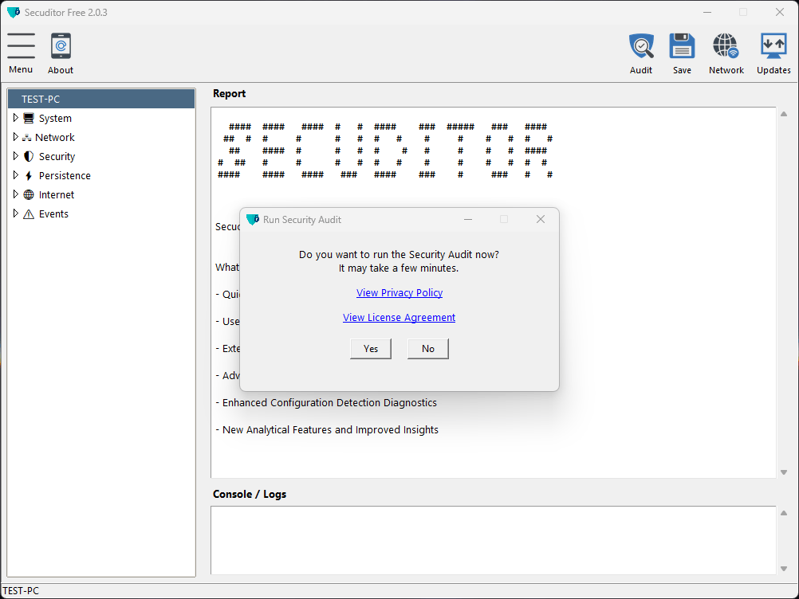

  

# Secuditor Free

An effective free diagnostic security tool for Windows endpoints and networks with a friendly GUI. 
Secuditor helps identify vulnerabilities, improve security awareness and simplifies forensic analysis. It suits both personal and organizational use.

---

## 🛡️ Key Features

- Quick Comprehensive Endpoint Security Audit
- User Friendly Graphical Interface Design (GUI)
- Extended or Short Easy to Export Reports (TXT)
- Advanced SSL/TLS Interception Detailed Analysis
- Enhanced Configuration Detection Diagnostics
- New Analytical Features and Improved Insights

---

## 💿 Standard Edition

Compatible with:
- Windows 10 / 11
- Windows Server 2016 / 2019 / 2022

---

## 🎬 Application Demo

---

## 🚀 Getting Started

### 1️⃣ Download the ZIP file
- #### [SecuditorFree_2.0.3.zip](https://github.com/secuditor/secuditor-free/releases/download/2.0.3/SecuditorFree_2.0.3.zip)

### 2️⃣ Extract & Run
- Unzip the file
- Double-click **SecuditorFree.exe**
- For all features to work it is recommended to "Run as administrator"

---

## 🟢 Safety Notice

**Secuditor Free** is digitally signed and safe for use.
Please ensure that you download the software only from the official source.

Since it is based on Python code, some antivirus programs may incorrectly flag or block its operation.
If you trust this application, you may need to create an **exception**, add it to a **whitelist** or **restore** the file from your antivirus software’s quarantine area.

Microsoft Defender SmartScreen may also display a warning because **Secuditor Free** is a new, verified application.
When the SmartScreen warning appears:
1. Click **“More info”**  
2. Verify that the **Publisher** is `Menahem Levinski`  
3. Click **“Run anyway”**

---

## 📄 Privacy Policy

**Secuditor Free** is a diagnostic security tool that runs locally on your device.  
It does **not collect, store, or transmit any personal data** or system information without the user’s explicit action or consent.

All analyses and reports are generated and stored locally in the same folder where the software resides.  
No personal information is sent automatically.

The application may periodically communicate with our secure servers to:
- Verify the availability of software updates.
- Retrieve updated security resources, including threat intelligence feeds and reputation databases.
- These connections transmit only non-personal, technical data (e.g., version identifiers or checksum values).

Optional online checks (like public IP lookups or external connection analysis) are performed **only when initiated by the user**.  
All logs and cache generated by the software are stored locally on your device (e.g., in *Documents* or *Cache* folders).

---

## 🔗 More Information

- **[Changelog](CHANGELOG.md)**
- **[Software License](LICENSE.txt)**
- **[Third Party Attribution](THIRD_PARTY_LICENSES.txt)**
- **Website:** [https://secuditor.com](https://secuditor.com)
- **Contact:** info@secuditor.com

---

© 2025 Menahem Levinski. All rights reserved.

